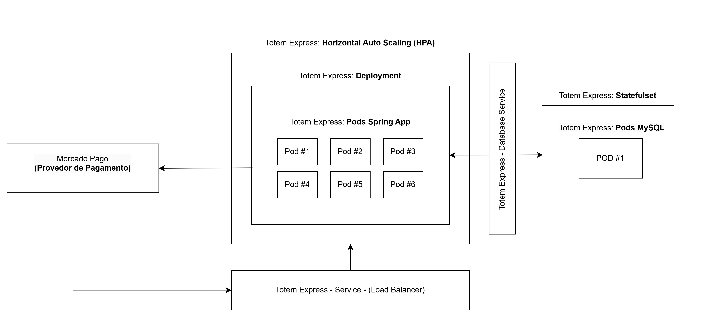

# Totem Express

---

Este é o nosso projeto para a pós graduação em **Software Architecture da FIAP**.
O "Totem Express" tem como objetivo ser um sistema de gestão interna de restaurante, sendo o ponto de conexão entre os clientes e a cozinha.

### Event Storming & Documentação do Sistema

O Event Storm e a documentação dos eventos pivotais pode ser encontrado [no seguinte Miro](https://miro.com/app/board/uXjVK3rqGz4=/?share_link_id=859281805316)

### Tech Challenge - 2

Abaixo é possível encontrar os links dos entregáveis da segunda parte do Tech Challenge:

- [Apresentação Totem Express](https://www.youtube.com/watch?v=1tUoONgTAUQ)
- [Arquitetura Totem Express](https://1drv.ms/i/c/2a3ce5fc95d7c822/EawciBkU0GhJheBFQu3EswMBhaPUpQd3Yjrpr-VWEwuIRw?e=OnmlGN)

### Kubernetes



Para o segundo tech-challenge optamos por utilizar o Minikube de maneira local para montar a nossa infraestrutura, os arquivos de manifesto podem ser encontrados [dentro da pasta k8s](./k8s).

Em relação a nossa escolha arquitetura optamos por:

- Um **Horizontal Pod Autoscalling (HPA)** que irá referenciar o **Deployment** da nossa aplicação, sendo responsável por aumentar e diminuir a quantidade de pods de acordo com as métricas de recursos definidas.
Desta forma, conseguimos garantir que a aplicação se matenha estável durante horários de pico (almoço e jantar).
- Um **Deployment** que inicia um servidor Java com Springboot
- Um Service do tipo **"Load Balancer"** para expor um ip público e fazer o balanceamento de carga das requisições para os pods
- Um **StatefulSet**  para iniciar uma imagem do banco **MySQL** e obter um **volume persistente de dados (PV)**
- Um **Service** para fazer a comunicação interna entre as aplicações do cluster e banco de dados
- **Secrets** e **Configmaps** para prover as definições de configurações e senhas, tanto para a aplicação java, quanto para o banco de dados.
---

#### Tecnologias


![[mysql]](https://img.shields.io/badge/Mysql_8.4-316192?style=for-the-badge&logo=mysql&logoColor=white)


Para desenvolver o projeto utilizamos as seguintes técnologias:

- **Java 22** como linguagem de programação backend.
- **Spring Boot 3** como framework web.
- **MySQL 8.4** como banco de dados relacional
- **Docker** como gerenciador de containers.

### Requerimentos (Rodando de Forma Local)

- É necessário estar com a porta **8080** livre para que o servidor web funcione corretamente. 
- É necessário estar com a porta **3306** livre para que o banco de dados mysql funcione corretamente.

### Arquitetura

O projeto precisava ser desenvolvido seguindo príncipios da **Arquitetura Hexagonal**, para isso separamos nossa aplicação nos seguintes módulos:

1) `Application`

Neste módulo teremos as definições de contratos a cerca das regras de négocio da aplicação, isto é, quais serão os inputs, outputs e componentes necessários para processar os dados.

2) `Domain`

Neste pacote temos a definição das entidades de domínio da nossa aplicação.

3) `Infrastructure`

Neste pacote temos os arquivos de infraestrutura da nossa aplicação, como por exemplo, configuração do banco de dados com o `Spring Data JPA` e a definição das entidades do banco.

4) `Presentation`

A camada de apresentação, neste caso, é uma aplicação web `REST`, ou seja, neste pacote teremos as configurações do nosso servidor http.


5) `Shared`

Este pacote tem como objetivo exportar classes de utilidade (ex: validação e formatação de dados), que podem ser utilizadas por outros módulos, esses arquivos são puros e não dependem de biblioteca.

---

### Como utilizar?

Para utilizar o "**Totem Express**" siga os seguintes comandos:

1) Faça o download do repositório 

```shell
git clone https://github.com/geggr/software-architecture-fiap.git
```

2) Entre no projeto

```shell
cd software-architecture-fiap/
```

3) Com o [`Docker`](https://docs.docker.com/desktop/) instalado em sua máquina execute o seguinte comando

```shell
docker compose up
```

4) Após isso [basta apenas acessar a rota principal para ter acesso a documentação](http://localhost:8080)

### Rotas da Aplicação 

| Endpoint                    | Método HTTP | Parâmetros  de Busca          | Descrição                     |
|-----------------------------|-------------|-------------------------------|-------------------------------|
| `/api/users`                | `POST`      |                               | Cria um usuário (cliente) comum no sistema         
| `/api/users?document`       | `GET`       | Documento (CPF) do usuário    | Retorna o usuário cadastrado no sistema com aquele CPF. 
| `/api/product`              | `POST`      |                               | Cadastra um produto no Totem.
| `/api/product`              | `PUT`       |                               | Atualiza informações do produto no Totem.
| `/api/product`              | `DELETE`    |                               | Remove um produto do Totem.            
| `/api/product/{category}`   | `GET`       | Categoria do Produto Desejado | Retorna os produtos cadastrados no Totem para determinada categoria.
| `/api/order/create`         | `POST`      |                               | Cadastra um pedido no sistema.
| `/api/order/list`           | `GET`       |                               | Retorna os pedidos cadastrados no sistema.
| `/api/order/{id}/next`      | `GET`       | Identificaodr do pedido       | Atualiza o status do pedido para a próxima etapa
| `/api/payment/id`           | `GET`       |                               | Checa o status de um pagamento
| `/api/payment/process/{id}` | `POST`      | Identificador da transação    | Processa o pagamento de um pedido


### Populando o Banco de Dados

Dentro do projeto, temos um arquivo para criar uma base de dados para testar os endpoints, o arquivo `seed/seed.js` pode ser executado utilizando um interpretador javascript como o [Node.JS](https://nodejs.org/en/download/package-manager), para isso basta, dentro do projeto executar:

```shell
node seeds/seed.js
```

Esse script irá criar:

- 2 lanches
- 2 acompanhamentos
- 2 sobremesas
- 2 bebidas
- 1 cliente do restaurante
- 5 pedidos

### Testando chamadas às APIs da aplicação

Temos uma collection do Postman no projeto que executa todas nossas chamadas de API, já com exemplos populados e que, se executados em ordem, seguirão um fluxo específico que explore toda nossa API. No caso, esse fluxo é:

- cria um prato principal
- cria uma bebida
- cria um acompanhamento
- cria uma sobremesa
- atualiza dados do prato principal
- traz os pratos principais cadastrados
- deleta a sobremesa do sistema
- cria um cliente
- checa se o cliente consta no sistema
- cria um pedido
- atualiza o status do pedido
- lista pedidos
- consulta o status do pagamento do pedido feito
- atualiza o status do pagamento do pedido feito, sinalizando que está pago

A collection se encontra [neste arquivo do projeto](docs/postman/Totem%20Express.postman_collection.json).

### Front-End

Para esse projeto não era necessário implementar um `front-end`, porém, para testar de maneira mais fidedigna
a aplicação optamos por [criar um projeto que simulasse um totem de fast-food](https://github.com/geggr/totem-express-ui/)

É possível observar a implementação das funcionalidades [dentro da nossa documentação](docs/totem-express-ui.md)
