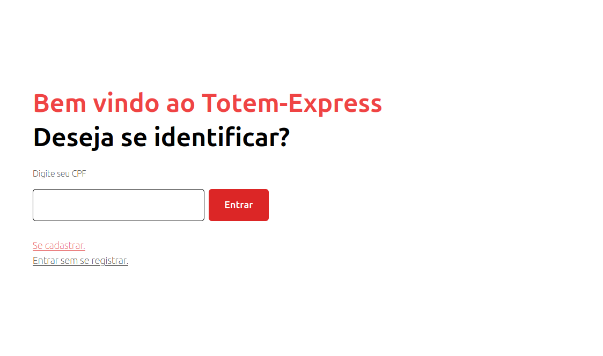
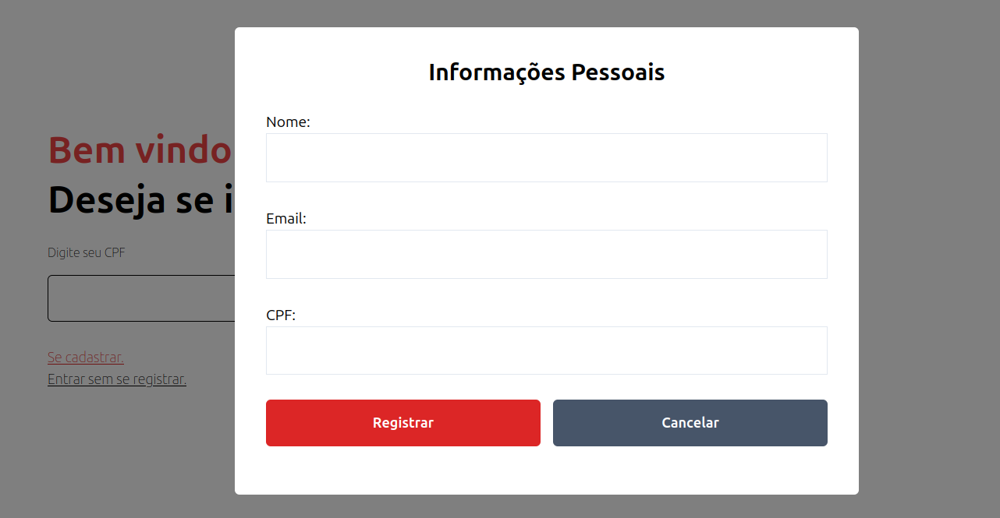
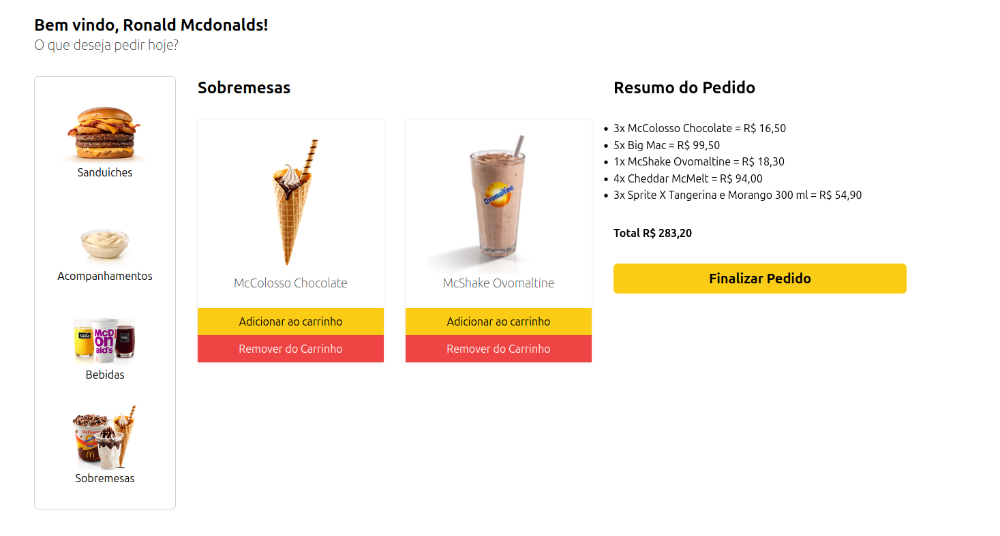
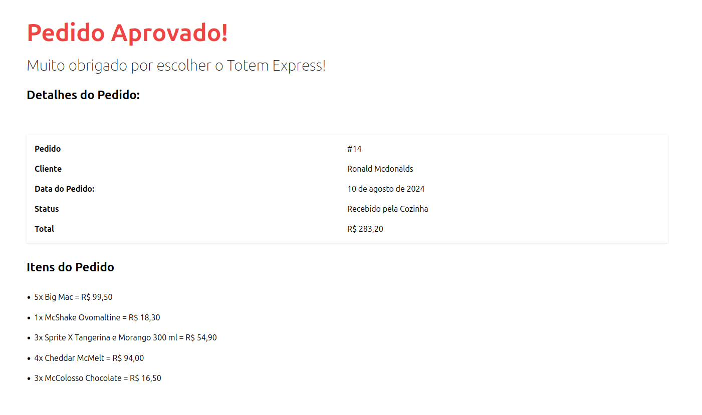
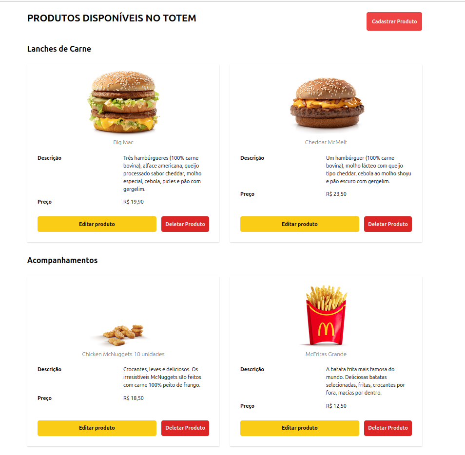
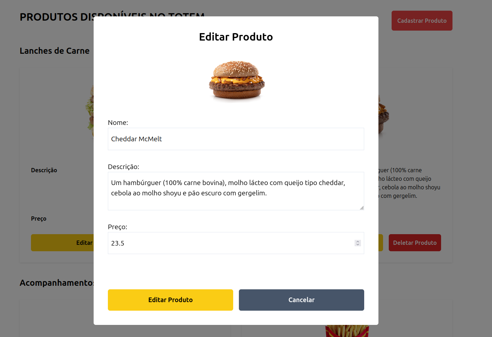
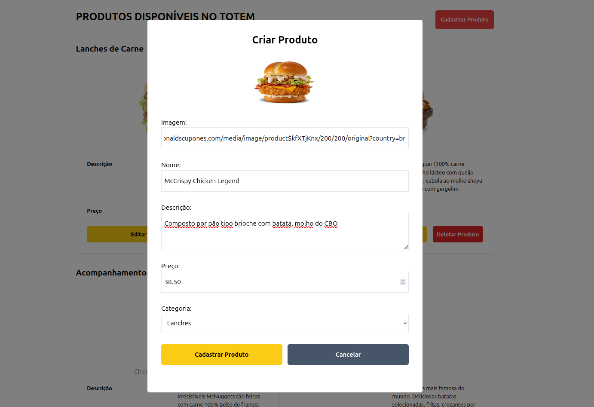
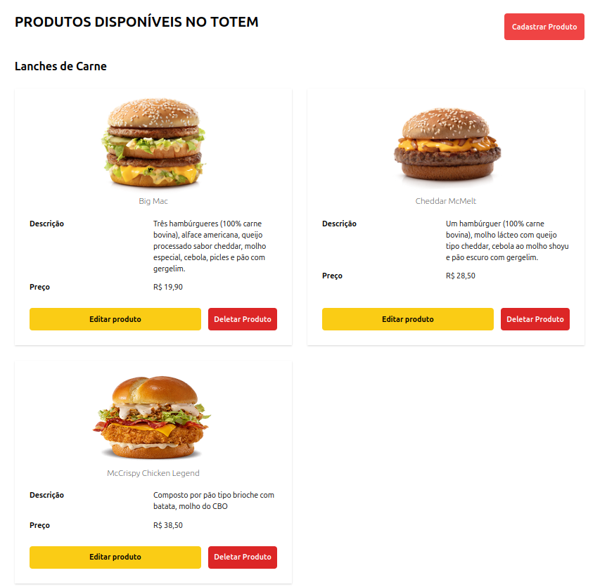
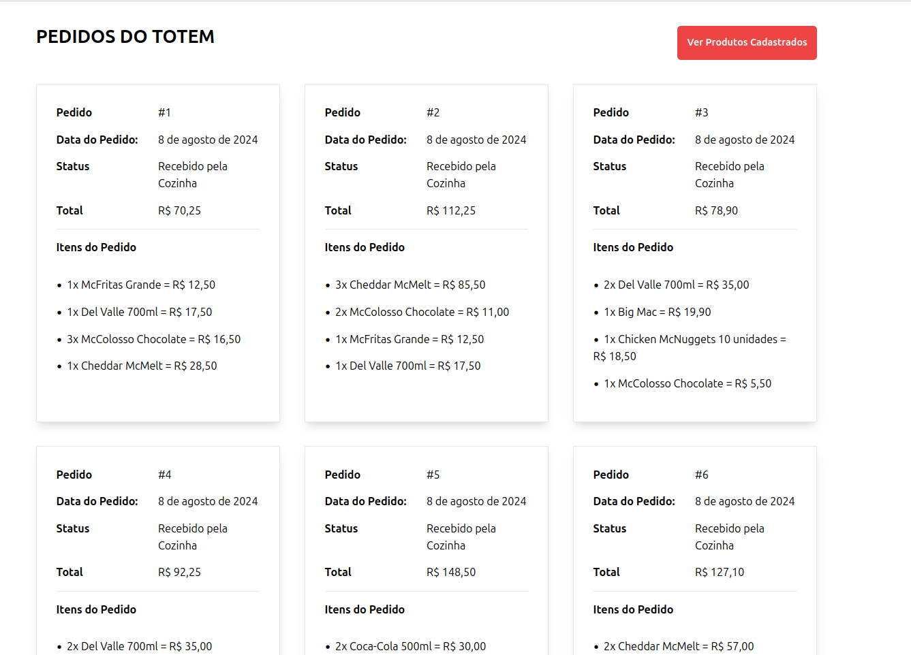

# Totem Express UI

Para o projeto não é necessário ter uma implementação `front-end`, entretanto para testar
de maneira mais realística, implementamos em `Vue` toda parte visual do totem.

---

## Cliente

### Parte 1: Identificação do Usuário

Ao acessar o totem o usuário tem 3 opções
- **Se identificar utilizando seu cpf**
- **Se cadastrar no sistema**
- **Entrar sem se identificar**

### Parte 2: Seleção de Produtos

Após o processo de identificação o usuário tem uma seleção de produtos separado pelas 4 categorias definidas:
- Lanches
- Bebidas
- Acompanhamentos
- Sobremesas

### Parte 3: Criação de Pedido

O usuário pode navegar entre as seções e optar por adicionar ou remover do carrinho o produto:

### Parte 4: Finalização do Pedido

Após escolher todos os produtos, o usuário pode finalizar o seu pedido o que o levará a uma tela com:
- Identificador do Pedido
- Status do Pedido
- Itens escolhidos

E com isso temos o fluxo do Cliente finalizado.

----

## Administrativo

### Parte 1: Listagem dos Produtos

Os usuários administrativos do totem tem acesso a uma listagem diferente dos produtos que estão disponíveis
para os usuários escolherem:

### Parte 2: Edição de Produto

Ao clicar no botão de **"Editar Produto"**, o administrador é direcionado a um modal onde pode estar alterando as informações
do produto.

### Parte 3: Remoção de Produto

Analogamente, ao clicar no botão de **"Deletar Produto"** o item é removido das escolhas do totem.

### Parte 4: Criação do Produto

Na parte superior do menu há a opção de cadastrar um novo item, ao clicar o administrador preenche um
formulário de cadastro com as informações a cerca do item:

E após isso o produto já está diponível para ser escolhido no totem

### Parte 5: Listagem de Pedidos

Além disso, os usuários administrativos tem acesso a uma listagem dos pedidos para que eles possam ser produzidos pela cozinha:

E desta forma temos o fluxo administrativo finalizado.